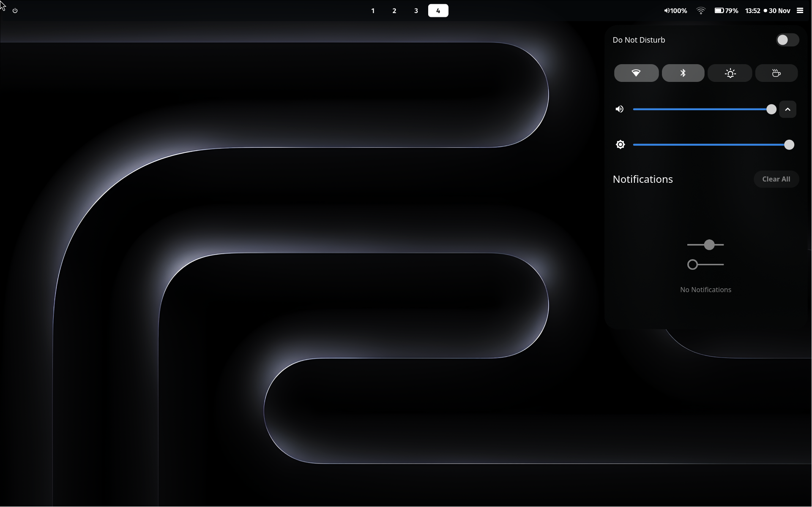
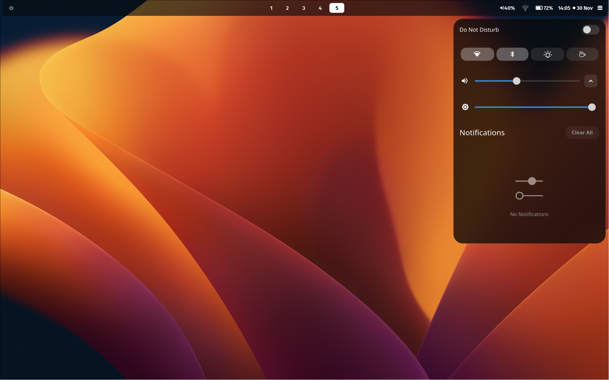
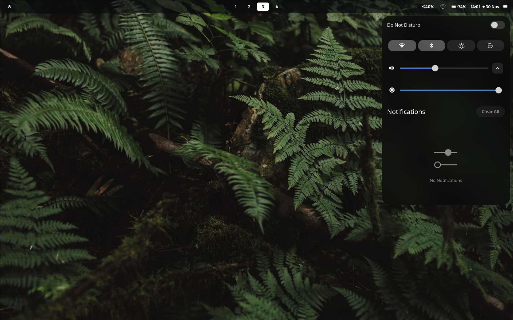
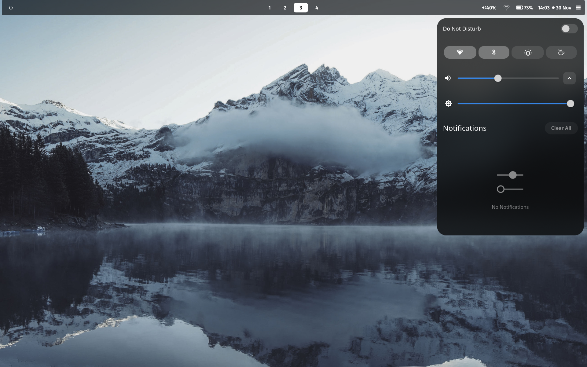
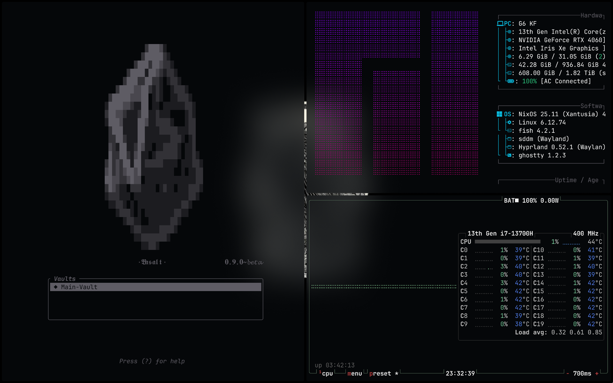
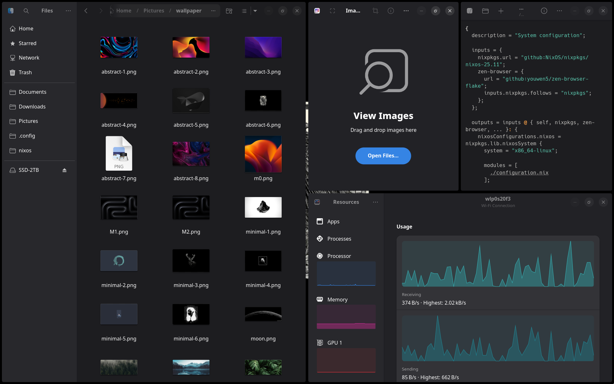

## Hyprland and Shell

  
  
  
  

## Ghostty TUI 

  

## Adwaita GUI

  

---

A Structured and Reproducible configuration using GNU Stow.
This repository contains my production dotfiles,
this collection is intentionally minimal, and is intended to be used with a nix-project.
custom configurations are seperated from the system's through the useage of symlinks.
current configurations follows the UNIX principle, though many tasks may later be handled by quickshell.

## GNU Stow commands 
Configs under `~/` including `.config` are stored in:
`~/.dotfiles/`

Example:
`origin:  ~/.dotfiles/config/hypr/main.lua`
`symlink: ~/.config/hypr/main.lua`

Apply config:
`cd ~/.dotfiles/config`
`stow -n -v -d ~/.dotfiles -t ~/.config config` (dryrun)
`stow -d ~/.dotfiles -t ~/.config config` (apply)

Remove config:
`stow -D -t ~/.config */`

Each top-level folder is a Stow package; Stow handles its contents recursively.

---

## System & Desktop Layer
#### Foundational components that shape the core desktop experience.
- Hyprland
- Hyprlock
- Hyprsunset
- SwayNC
- SwayOSD
- vicinae
- Waybar

#### Tools that define the interactive and programming environment.
- ghostty
- micro
- yazi
- Btop
- fastfetch
